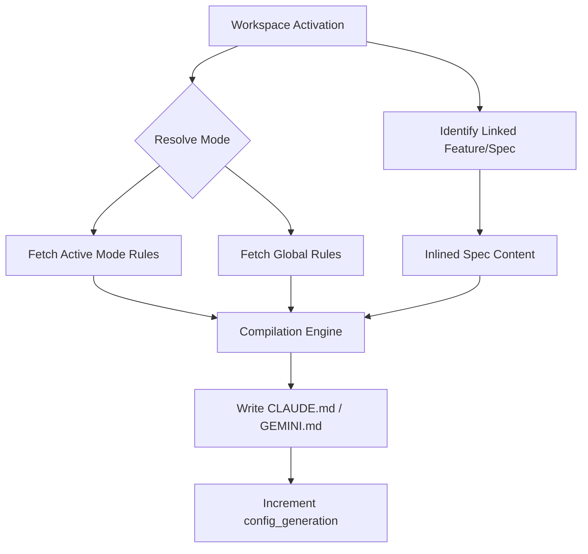

# Workspace and Session Lifecycle

Ship manages project memory through **Workspaces** and **Sessions**. This document outlines how these entities interact, how state is persisted, and how context is injected into agent environments.

## Workspaces

A **Workspace** is the runtime state associated with a specific unit of work, typically mapped to a **git branch**. While features and specs are persisted in git as markdown files, the workspace state itself lives in a local SQLite database (`.ship/state.db`).

### Key Attributes

- **Branch**: The primary key. Can be a literal git branch (e.g., `feature/login`) or a standalone runtime key.
- **Active Mode**: The selected `AgentMode` for this workspace. Affects which rules and skills are injected.
- **Context Hash**: A fingerprint of the injected context at the time of the last activation.
- **Config Generation**: A monotonic counter that increments every time the provider context (e.g., `CLAUDE.md`) is re-compiled.

### Activation Lifecycle

When you switch to a workspace (e.g., via `git checkout` or the Ship UI):

1. **Activation**: The workspace status is set to `active`, and `last_activated_at` is updated.
2. **Hydration**: Ship identifies links to features, specs, and releases based on the branch name.
3. **Compilation**: The `export` engine runs for all connected providers (Claude, Gemini, etc.), writing native config files (`CLAUDE.md`, `GEMINI.md`, `.mcp.json`).
4. **Generation Update**: `config_generation` is incremented.

---

## Workspace Sessions

A **Session** represents a continuous period of active agent work within a workspace. Sessions track what the agent is currently trying to achieve.

### Lifecycle Phases

1. **Start**: A session is initialized with a `goal` and a `mode_id`. It captures the current `config_generation` as `config_generation_at_start`.
2. **Execution**: The agent works within the environment provided by the compiled context files.
3. **Stale Context Detection**: If the workspace context is re-compiled (e.g., a rule is changed or the spec is updated) while a session is active, the session is marked as `stale_context = true`. This alerts the user/agent that the injected files no longer match the project's source of truth.
4. **End**: The session is closed with an optional `summary` and a list of `updated_entities` (features/specs modified during the session).

---

## State Persistence

| Entity | Storage | Git Tracked? |
| :--- | :--- | :--- |
| **Feature / Spec** | Markdown + TOML | **Yes** (in `.ship/project/...`) |
| **Workspace** | SQLite | **No** (Local runtime state) |
| **Session** | SQLite | **No** (Local history) |
| **Agent Modes** | Markdown + TOML | **Yes** (in `.ship/agents/modes/...`) |

---

## Context Injection Flow

The following flow is triggered on every workspace activation and session start:

### Compile Hardening

Ship implements "compile hardening" to ensure agents never work with broken context:
- If a provider export fails (e.g., missing mandatory skill), the `compile_error` is stored on the workspace.
- The previous context file is preserved if possible, or a "Safe Mode" context is written with the error message.
- Sessions started during a compile error state will explicitly show the degradation in the UI.
